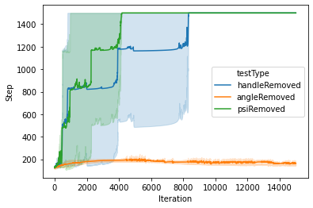

# Balancing and Navigating a Bicycle with Backpropagation Through Time (BPTT)

This project implements a bicycle model introduced by [Randløv and Alstrøm (1998)](https://doi.org/10.1162/089976698300017805), demonstrating the application of Backpropagation Through Time (BPTT) to control a simulated bicycle's balance and navigation. Key modifications to the model enable it to be differentiable, allowing a neural network to learn control inputs based on sensory information.

## License

This project is licensed under the MIT License — see the [LICENSE](LICENSE) file for details.


## Overview
Balancing and navigating a bicycle involves complex motor coordination, sensory processing, and dynamic control. The BPTT algorithm, typically used in sequential prediction tasks, is explored here as a tool for control in reinforcement learning, with specific adjustments to handle the unique dynamics of bicycle balance and navigation.

### Differentiable Model Adjustments
To apply BPTT effectively, modifications to the original Randløv bicycle model were necessary. Traditional `if-else` conditions that hindered differentiability were replaced with TensorFlow functions, ensuring a differentiable framework compatible with BPTT. For example:

```python
# Original non-differentiable code
if front_term > 1:
    front_term = sign(psi + theta) * 0.5 * np.pi
else:
    front_term = sign(psi + theta) * arcsin(front_term)
```
Was modified to:
```python

# Differentiable TensorFlow code
front_term = psi + theta + tf.sign(psi + theta) * tf.asin(v * df / (2. * r_f))
```
These adjustments allowed gradients to be computed effectively without introducing non-differentiable points.

Reward Shaping and Penalty Functions
Reward shaping enhances learning by guiding the agent's trajectory towards goals while balancing penalties for deviations. A custom penalty function uses a flat-bottomed barrier, modulated with a tanh function for smoother gradient transitions, enabling the agent to balance while preventing extreme penalties that destabilize learning:

```python
penalty_FBBF = max(value / k_width * 0.5 - 1, 0) ** k_power
```
This approach allows the agent to focus on critical moments in the balancing task rather than points of irrecoverable deviation.

Results and Visual Analysis
The experiments evaluated agent performance with and without an early termination condition when exceeding a specific roll angle. Notably, the tanh-wrapped penalty function led to smoother and more stable learning trajectories, as visualized in the results below:



Without Early Termination, The agent could maintain balance and achieve steady navigation.
With Early Termination: The penalty function allowed controlled resets, facilitating further exploration and learning stability.
Graphs show the agent’s balanced paths and roll angles across trials, underscoring the influence of reward shaping on task performance.


Discussion
The experiments illustrate how effective reward shaping and differentiable adjustments support robust learning in control tasks involving long-horizon, sequential data. By leveraging techniques such as the tanh wrapper, the model demonstrates stable learning and trajectory tracking, making this approach applicable to continuous control tasks requiring dynamic balance and navigation.
